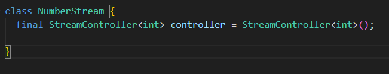
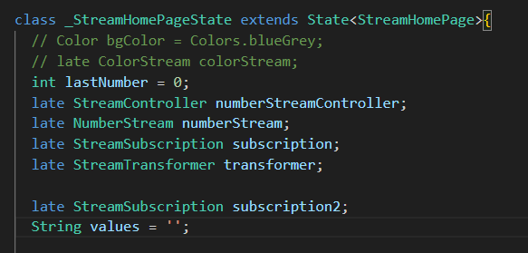
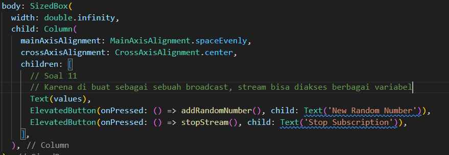
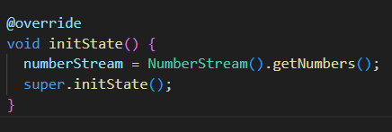
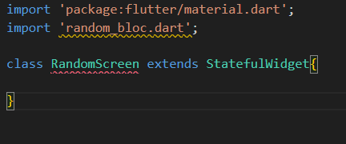

# Stream

# Praktikum
## Praktikum 1
### Langkah 2

### Langkah 4

### Langkah 6

### Langkah 8

### Langkah 9

### Langkah 10

### Langkah 11

### Langkah 12

### Langkah 13

## Praktikum 2
### Langkah 3

### Langkah 4

### Langkah 5

### Langkah 7

### Langkah 8

### Langkah 9

### Langkah 10

### Langkah 11

### Langkah 12

### Langkah 13

### Langkah 14

### Langkah 15

## Praktikum 3
### Langkah 1

### Langkah 2

### Langkah 3

### Langkah 4

## Praktikum 4
### Langkah 1

### Langkah 2

### Langkah 3

### Langkah 4

### Langkah 5

### Langkah 6

### Langkah 7

### Langkah 8

### Langkah 9

### Langkah 10

## Praktikum 5
### Langkah 1

### Langkah 2

### Langkah 3

### Langkah 4

### Langkah 5

### Langkah 6

## Praktikum 6
### Langkah 3

### Langkah 4

### Langkah 5

### Langkah 6

### Langkah 7

### Langkah 8

## Praktikum 7
### Langkah 4

### Langkah 5

### Langkah 6

### Langkah 7

### Langkah 9

### Langkah 11

### Langkah 12

### Langkah 3

# Soal
## Soal 1

## Soal 2

## Soal 3

## Soal 4

<video src="Images/Soal 4.mp4" width="400" controls></video>

## Soal 5

## Soal 6

<video src="Images/Soal 6.mp4" width="400" controls></video>

## Soal 7

## Soal 8

<video src="Images/Soal 8.mp4" width="400" controls></video>

## Soal 9

<video src="Images/Soal 9.mp4" width="400" controls></video>

## Soal 10

## Soal 11

<video src="Images/Soal 11.mp4" width="400" controls></video>

## Soal 12

<video src="Images/Soal 12.mp4" width="400" controls></video>

## Soal 13

<video src="Images/Soal 13.mp4" width="400" controls></video>